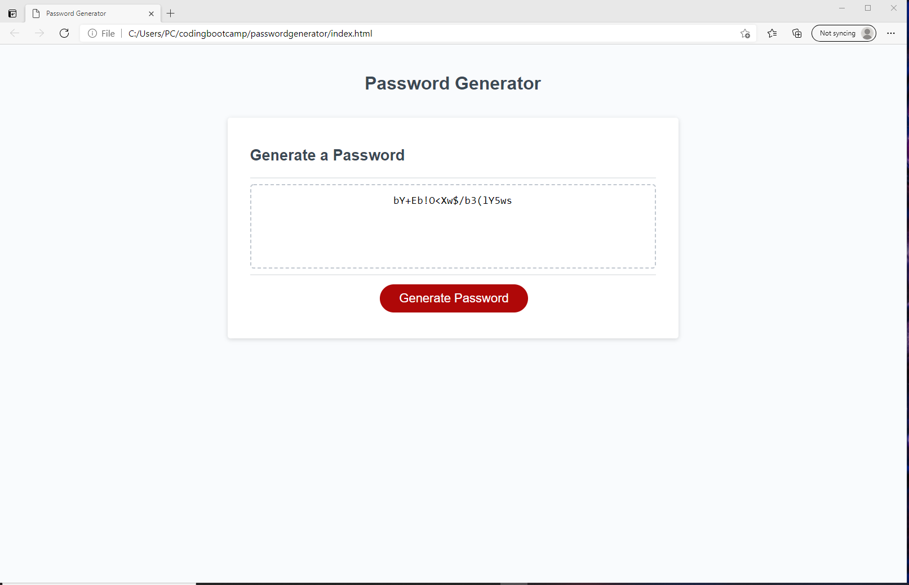

# Password Generator

## In this project I was assigned to create the script for a random password generator using Javascipt. I started by pseudo coding how I would make this project and what the requirements were. Throughout the process there were a lot of learning points which made me realize there was multiple ways to do this. I chose to write my script this way because it seems clean and well structured for anyone that reads it. I took on the task head on and came up with a generator that would provide you a password with all of your requests included.

## Technology I Put to Work
- GitHub - repository storage for the project in order to amke changes, deploy them and push to a main branch. 

- GitBash - used for written commands and communicating witht he repository stored on GitHub.

- HTML - used to create and edit electronic documents stored on the web.

- Javascript - a programming language used to create specific events and make your website pop to viewers.

## Site Preview

## How was it made?
``Javascript

function writePassword() {
  var password = generatePassword();
  var passwordText = document.querySelector("#password");
  passwordText.value = password;
}
// Add event listener to generate button
generateBtn.addEventListener("click", writePassword);

function generatePassword() {
      // This will prompt the user to enter the number of characters they want with restrictions
    userNumber = prompt("How many characters is your password?");
    var userWants = "";
      // If the number the user chose is less than 8 or greater than 128, the alert will pop up leading them back to the beginning
    if (userNumber >= userMinChar && userNumber <= userMaxChar) {
      wantUpper = confirm("Would you like to use Capitol Letters?");
      wantLower = confirm("Would you like to use Lower Case Letters?");
      wantSymbols = confirm("Would you like to use Symbols?");
      wantNumbers = confirm("Would you like to use Numbers?");
    } else if (userNumber == null){
    } else {
        alert("Your password must contain at least 8 characters and no more than 128 characters!");
        generatePassword();

## The full website is deployed here! Click and take a look!

## Links to my other Professional Site's!

[LinkedIn](https://www.linkedin.com/in/david-jacob-novelli/)

[GitHub](https://github.com/dnovelli1)

