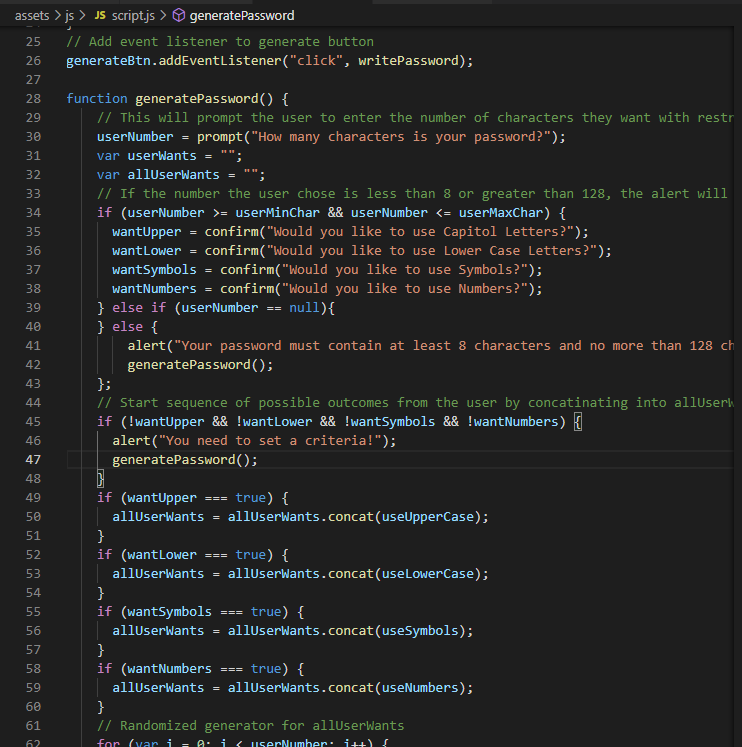

# Password Generator

## In this project I was assigned to create the script for a random password generator using Javascipt. I started by pseudo coding how I would make this project and what the requirements were. Throughout the process there were a lot of learning points which made me realize there was multiple ways to do this. I chose to write my script this way because it seems clean and well structured for anyone that reads it. I took on the task head on and came up with a generator that would provide you a password with all of your requests included.

## Technology I Put to Work
- GitHub - repository storage for the project in order to amke changes, deploy them and push to a main branch. 

- GitBash - used for written commands and communicating witht he repository stored on GitHub.

- HTML - used to create and edit electronic documents stored on the web.

- Javascript - a programming language used to create specific events and make your website pop to viewers.

## Site Preview

## How was it made?
Javascript  

## The full website is deployed here! Click and take a look!

[Full-Site](https://dnovelli1.github.io/passwordgenerator/)

## Links to my other Professional Site's!

[LinkedIn](https://www.linkedin.com/in/david-jacob-novelli/)

[GitHub](https://github.com/dnovelli1)

## License

Licensed under the [MIT License](LICENSE).

